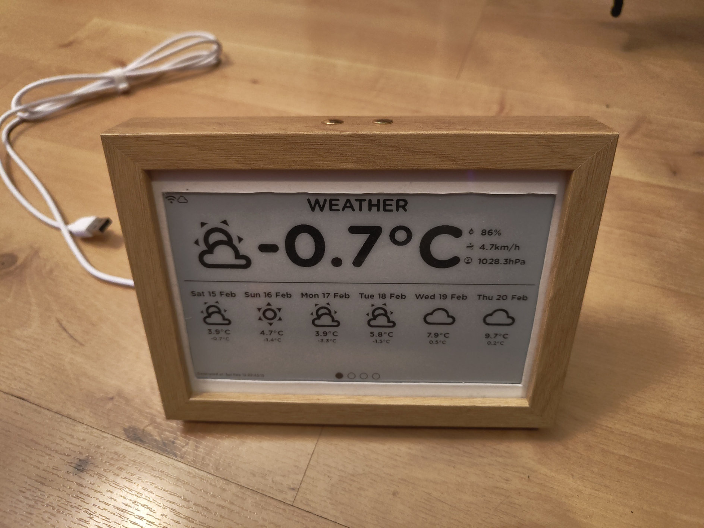
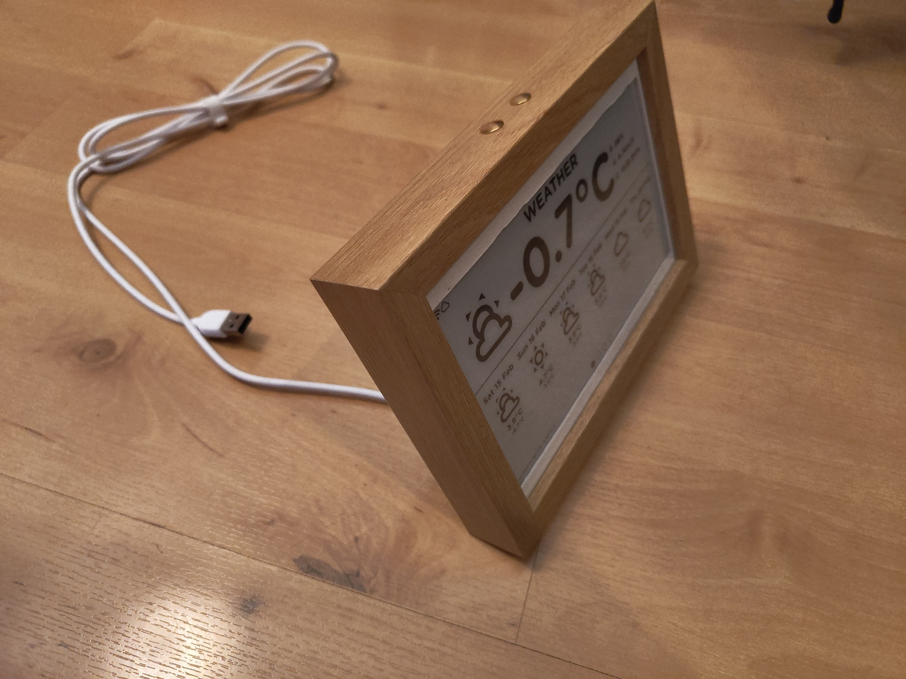
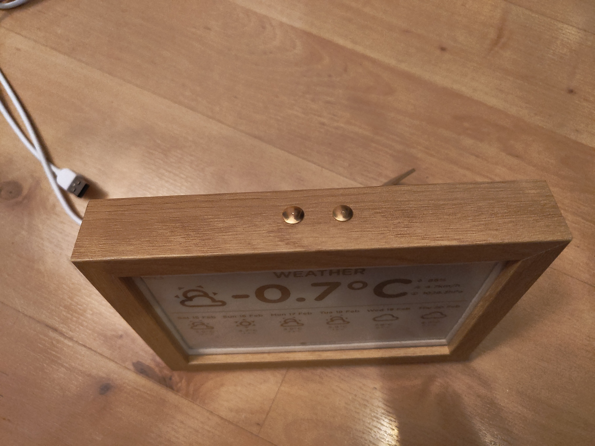
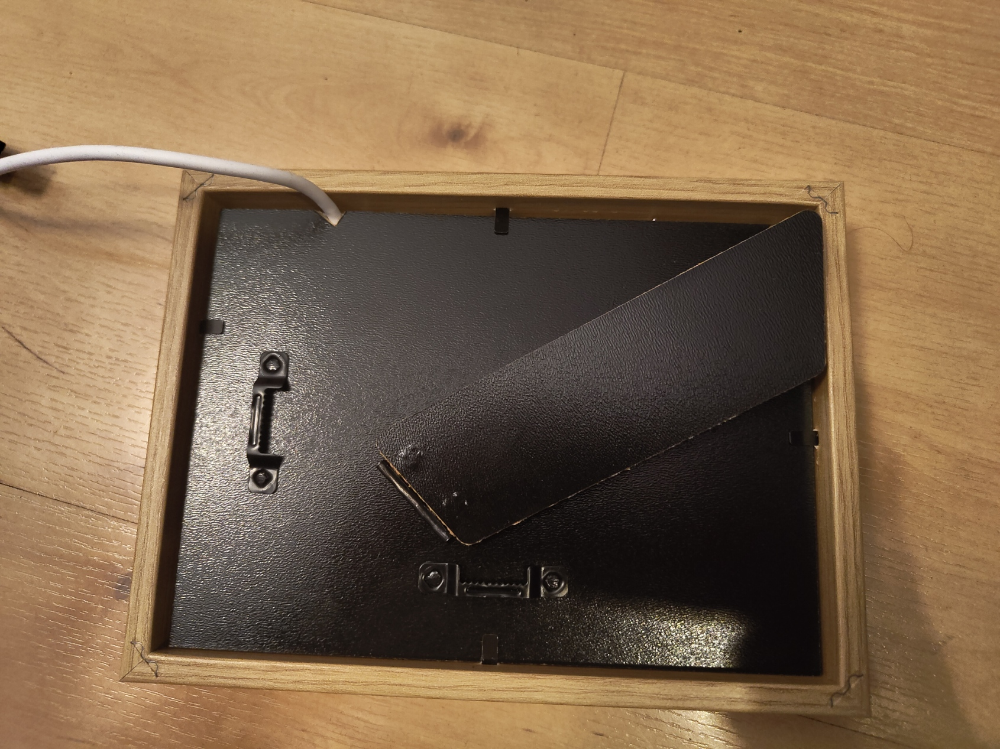

[](https://goreportcard.com/report/github.com/topi314/esphome-dashboard)
[](https://golang.org/doc/devel/release.html)
[](LICENSE)
[](https://github.com/topi314/esphome-dashboard/releases/latest)
[](https://github.com/topi314/esphome-dashboard/actions/workflows/build.yml)
[](https://discord.gg/sD3ABd5)

# ESPHome Dashboard

> [!IMPORTANT]
> If you are using an ESP32 without PSRAM this does not seem to work with esphome 2025.2.0+. I recommend using an older version of esphome until I find a solution.

A simple Go service to render a custom HTML/CSS dashboard as a PNG image from [Home Assistant](https://www.home-assistant.io/) entities.

This service is intended to be used with [ESPHome](https://esphome.io/) devices that have a display and can show a PNG image.

 

 

## Table of Contents

<details>
<summary>Click to expand</summary>

- [Features](#features)
- [Installation](#installation)
    - [Docker Compose](#docker-compose)
    - [ESPHome](#esphome)
- [Configuration](#configuration)
    - [Dashboard Configuration](#dashboard-configuration)
    - [ESPHome Configuration](#esphome-configuration)
- [Templates](#templates)
    - [Base Template](#base-template)
    - [Page Template](#page-template)
    - [Template Variables](#template-variables)
    - [Template Functions](#template-functions)
- [API](#api)
    - [Get Control](#get-control)
    - [Get Page](#get-page)
    - [Get Version](#get-version)
- [License](#license)
- [Contributing](#contributing)
- [Contact](#contact)

</details>

## Features

- Customizable dashboard with HTML/CSS/JS & [Go template](https://pkg.go.dev/html/template)
- Fetch data from Home Assistant entities, actions & calendars
- Render the dashboard as a PNG image or HTML/CSS/JS
- Cycle through multiple pages of the dashboard (via interval or touch sensitive buttons)
- Use the [Home Assistant REST API](https://developers.home-assistant.io/docs/api/rest) to fetch data
- ESPHome device configuration for ESP32 with WaveShare 7.5inch e-Paper HAT (v2) display & touch sensitive buttons

## Installation

You can either run the binary directly on your machine or use the provided Docker image.

### Docker Compose

Here is an example [`compose.yml`](compose.yml) file to get you started:

```yaml
services:
  esphome-dashboard:
    image: ghcr.io/topi314/esphome-dashboard:latest
    container_name: esphome-dashboard
    restart: unless-stopped
    volumes:
      # Mount your configuration file
      - ./config.toml:/var/lib/esphome-dashboard/config.toml
      # Mount your dashboard configuration & templates
      - ./dashboards/:/var/lib/esphome-dashboard/dashboards/
    ports:
      # Expose the service on port 8080
      - "8080:8080"
```

### ESPHome

## Configuration

The configuration is done via a TOML file. You can find an example configuration in the [example directory](example.config.toml).

To get a Home Assistant API token, follow the instructions [here](https://developers.home-assistant.io/docs/auth_api/#long-lived-access-token).

```toml
# Enable hot reloading of the built-in templates (only useful for development)
dev = false
# The address the server should listen on
listen_addr = "0.0.0.0"
# The port the server should listen on
listen_port = 8080
# The directory where your dashboards are stored
dashboard_dir = "/var/lib/esphome-dashboard/dashboards/"

[log]
# The log level (debug, info, warn, error)
level = "info"
# The log format (text, json, log-fmt)
format = "text"
# Whether to add the source location to the log output
add_source = true
# Whether to add the log level to the log output (only useful for text format)
no_color = false

# The Home Assistant configuration (optional)
[home_assistant]
# The hostname/IP of your Home Assistant instance
host = "localhost"
# The port of your Home Assistant instance
port = 80
# Whether to use HTTPS or HTTP to connect to Home Assistant
secure = false
# The Home Assistant API token
token = ""
```

### Dashboard Configuration

The dashboard configuration is also done via a TOML file. You can find an example configuration [here](dashboards/default/config.toml).

```toml
# The width in pixels of the dashboard (should be the same as the display width)
width = 800
# The height in pixels of the dashboard (should be the same as the display height)
height = 480
# The base template to use for the dashboard
# The path is relative to the dashboard directory
base = 'base.gohtml'
# The pages which can be injected into the base template
# The paths are relative to the dashboard directory
pages = [
    'pages/forecast.gohtml',
    'pages/mealplan.gohtml',
    'pages/calendar.gohtml',
    'pages/timeline.gohtml',
    'pages/pokemon-go-timeline.gohtml',
]

# The Home Assistant configuration (optional)
[home_assistant]
# The entities to fetch from Home Assistant
entities = [
    { name = 'Forecast', id = 'weather.forecast_home' },
]
# The calendars to fetch from Home Assistant (optional)
# name: The name of the calendar (used in the template)
# ids: The IDs of the calendars entities which should be fetched and merged
# days: The number of days to fetch events for (please note it we always start fetching from the week start (Monday))
# max_events: The maximum number of events to fetch from all calendars combined (optional)
# skip_past_events: Whether to skip past events (optional)
calendars = [
    { name = 'Mealie', ids = ['calendar.mealie_dinner', 'calendar.mealie_lunch'], days = 7 },
    { name = 'Calendar', ids = ['calendar.konzerte', 'calendar.urlaub', 'calendar.feiertage'], days = 28 },
    { name = 'Timeline', ids = ['calendar.konzerte', 'calendar.urlaub', 'calendar.feiertage'], days = 28, max_events = 10, skip_past_events = true },
    { name = 'PokemonGo', ids = ['calendar.pokemon_go_local_events'], days = 28, max_events = 10, skip_past_events = true },
]
# The services to call from Home Assistant (optional)
# name: The name of the service (used in the template)
# domain: The domain of the service
# service: The service to call
# return_response: Whether the service returns a response (optional)
# data: The data to send to the service (optional)
services = [
    { name = 'WeatherForecasts', domain = 'weather', service = 'get_forecasts', return_response = true, data = { entity_id = 'weather.forecast_home', type = 'daily' } },
]
```

### ESPHome Configuration

Here is an example ESPHome configuration for an `ESP32` with a `WaveShare 7.5inch e-Paper HAT (v2)` display & touch sensitive buttons.

Make sure to copy [`config/common/dashboard-base.yaml`](config/common/dashboard-base.yaml) to your ESPHome configuration directory (e.g. `esphome/common/dashboard-base.yaml`).

```yaml
packages:
  dashboard: !include
    file: common/dashboard-base.yaml
    vars:
      touch_threshold: 1000 # Change this to a higher value if the touch buttons are too sensitive
      display_rotation: 0° # Change this to 90°, 180° or 270° if your display is rotated
      base_url: 'http://192.168.178.68:1234' # Change this to the IP of your dashboard server
      dashboard_name: 'default' # Change this to the name of your dashboard

esphome:
  name: dashboard
  friendly_name: Dashboard
  name_add_mac_suffix: false

wifi:
  ssid: !secret wifi_ssid
  password: !secret wifi_password

```

## Templates

The dashboard is rendered using Go templates. You can find an example dashboard in the [example directory](dashboards/default).

To get started with go templates I recommend reading the [`text/template`](https://pkg.go.dev/text/template) and the [`html/template`](https://pkg.go.dev/html/template) documentation.

### Base Template

The base template is a Go template which can be used to render the dashboard. You can find an example base template [here](dashboards/default/base.gohtml).
This template then includes the other pages which can be injected into the base template.

You can include the current Page with the following code:

```html
{{ template "page" . }}
```

Each page is additionally a Go template with the filename as the template name.

You can include the other pages with the following code:

```html
{{ template "forecast.gohtml" . }}
```

You can also include frontmatter in the templates to pass additional data to the template which is available in the `Vars` variable.
For pages they are available via `{{ .Page.Vars }}` and `{{ $page index .Pages 0 }} {{ $page.Vars }}` for the base template.

```html
---
title: "Weather"
---
<span>{{ .Vars.title }}</span>
```

You can include assets via the `assets` directory in the dashboard directory. The assets are then available via the `/dashboards/{dashboard}/assets/` route.
You can use a relative path to the assets directory in the template. For example, to include a CSS file you can use the following code:

```html
<link rel="stylesheet" href="../assets/style.css">
```

Here is the example base template:

```html
<style>
    @font-face {
        font-family: 'Gotham Round';
        font-style: normal;
        src: url("../assets/gothamrnd.otf") format("opentype");
    }

    * {
        box-sizing: border-box;
    }

    html, body {
        height: 100%;
        width: 100%;
        margin: 0;
        padding: 0;
        font-family: 'Gotham Round', system-ui;
    }

    body {
        display: flex;
        flex-direction: column;
    }

    h1 {
        margin: 0;
        font-size: 40px;
        text-transform: uppercase;
        font-weight: bolder;
    }

    .page {
        width: 100%;
        flex-grow: 1;
        display: flex;
        flex-direction: column;
        align-items: center;
        overflow: hidden;
    }

    .container {
        height: 100%;
        width: 100%;
        padding: 0 10px;
    }
</style>
<body id="root">
<div class="page">
    {{ template "page" . }}
</div>
{{ template "pages" . }}
{{ template "gen-time" }}
</body>
```

#### Page Template

The page template gets injected into the base template and can be used to render the content you want to display. You can find an example page
template [here](dashboards/default/pages/forecast.gohtml).

Styles and scripts are shared between the base and page templates.

This template calls the built-in [`forecast`](templates/forecast.gohtml) template which displays the weather forecast using
the [Home Assistant Weather Forecast](https://www.home-assistant.io/integrations/weather/#action-weatherget_forecasts) action.

It expects the following data to be passed to the template:

- `Now`: The current weather forecast entity from Home Assistant
- `Forecast`: The weather forecast service response from Home Assistant

```html
<h1>Weather</h1>
<div class="container">
    {{ $now := index .HomeAssistant.Entities.Forecast }}
    {{ $forecast := index .HomeAssistant.Services.WeatherForecasts.ServiceResponse "weather.forecast_home" }}
    {{ template "forecast" dict "Now" $now "Forecast" $forecast }}
</div>

```

#### Template Variables

The following variables are available in the dashboard templates:

- `PageIndex`: The current page index
- `Page`: The current page (this is a method)
    - `Index`: The index of the page
    - `Vars`: The frontmatter of the page
- `PageCount`: The total number of pages
- `Pages`: The list of pages
    - `Index`: The index of the page
    - `Vars`: The frontmatter of the page
- `Vars`: The frontmatter of the base template
- `HomeAssistant`: The Home Assistant entities, calendars & services
    - `Entities`: The entities to fetch from Home Assistant
        - `<Name>`: The entity name defined in the configuration
            - `EntityID`: The entity ID
            - `LastChanged`: The last changed timestamp (this is a [`time.Time`](https://pkg.go.dev/time#Time) struct)
            - `LastUpdated`: The last updated timestamp (this is a [`time.Time`](https://pkg.go.dev/time#Time) struct)
            - `State`: The state of the entity
            - `Attributes`: The attributes of the entity (this is a `map[string]any`)
    - `Calendars`: The calendars to fetch from Home Assistant
        - `<Name>`: The calendar name defined in the configuration (this is a `map[string][]CalendarDay` where [
          `CalendarDay`](https://pkg.go.dev/github.com/topi314/esphome-dashboard/dashboard#CalendarDay) is a struct)
            - `Time`: The day timestamp (this is a [`time.Time`](https://pkg.go.dev/time#Time) struct)
            - `IsPast`: Whether the day is in the past
            - `IsToday`: Whether the day is today
            - `Events`: The events of the day as a list
                - `Start`: The event start timestamp (this is a [`Date`](https://pkg.go.dev/github.com/topi314/esphome-dashboard/dashboard/homeassistant#Date) struct)
                - `End`: The event end timestamp (this is a [`Date`](https://pkg.go.dev/github.com/topi314/esphome-dashboard/dashboard/homeassistant#Date) struct)
                - `Summary`: The event summary
                - `Description`: The event description
                - `Location`: The event location
    - `Services`: The services to call from Home Assistant
        - `<Name>`: The service name defined in the configuration (this is a `map[string]Response` where [
          `Response`](https://pkg.go.dev/github.com/topi314/esphome-dashboard/dashboard/homeassistant#Response) is a struct)
            - `ChangedStates`: The changed states of the service as a list
                - `EntityID`: The entity ID
                - `LastChanged`: The last changed timestamp (this is a [`time.Time`](https://pkg.go.dev/time#Time) struct)
                - `LastUpdated`: The last updated timestamp (this is a [`time.Time`](https://pkg.go.dev/time#Time) struct)
                - `State`: The state of the entity
                - `Attributes`: The attributes of the entity (this is a `map[string]any`)
            - `ServiceResponse`: The service response (this is a `map[string]any`)

#### Template Functions

The following functions are available in the dashboard templates in addition to the [built-in functions](https://pkg.go.dev/text/template#hdr-Functions):

- `seq`: Generates a sequence of integers from 0 to n-1
    - `n`: The number of integers to generate
- `reverse`: Reverses a list
    - `list`: The list to reverse
- `parseTime`: Parses a RFC3339 time string into a [`time.Time]`(https://pkg.go.dev/time#Time) struct
    - `s`: The time string to parse
- `formatTimeToDay`: Formats a time into a day string (e.g. `Mon 02 Jan`)
    - `t`: The time to format
- `formatTimeToRelDay`: Formats a time into a relative day string (e.g. `Today`, `Tomorrow`, `Yesterday`, `Mon 02 Jan`)
    - `t`: The time to format
- `convertNewLinesToBR`: Converts new lines to `<br>` tags
    - `s`: The string to convert
- `safeHTML`: Marks a string as safe HTML so it is not escaped
    - `s`: The string to mark as safe
- `safeCSS`: Marks a string as safe CSS so it is not escaped
    - `s`: The string to mark as safe
- `safeJS`: Marks a string as safe JS so it is not escaped
    - `s`: The string to mark as safe
- `safeHTMLAttr`: Marks a string as safe HTML attribute so it is not escaped
    - `s`: The string to mark as safe
- `safeURL`: Marks a string as safe URL so it is not escaped
    - `s`: The string to mark as safe
- `safeJS`: Marks a string as safe JS so it is not escaped
    - `s`: The string to mark as safe
- `safeJSStr`: Marks a string as safe JS string so it is not escaped
    - `s`: The string to mark as safe
- `safeSrcset`: Marks a string as safe srcset so it is not escaped
    - `s`: The string to mark as safe
- `dict`: Creates a `map[string]any` from a list of key-value pairs
    - `kvs`: The list of key-value pairs (e.g. `dict "key1" value1 "key2" value2`)

## API

The API is a simple REST API which can be used to find the next page based on an action or get a specific page as a PNG image or HTML file.

### Get Control

This endpoint is used to get the next page index based on an action.

```http request
GET /dashboards/{dashboard}/control
```

Query Parameters:

| Name   | Description                                                                            |
|--------|----------------------------------------------------------------------------------------|
| action | The action to perform (`refresh`, `next_page`, `last_page`, `prev_page`, `first_page`) |

Response:

404 Not Found

200 OK:

* Content-Type: text/plain

```
1
```

the next page index

### Get Page

```http
GET /dashboards/{dashboard}/pages/{page}
```

Query Parameters:

| Name   | Default | Description                                                 |
|--------|---------|-------------------------------------------------------------|
| format | `html`  | The format of the response (`html`, `png`, `jpeg` or `bmp`) |

Response:

404 Not Found

200 OK:

* Content-Type: image/png

* Content-Type: text/html; charset=utf-8

### Get Version

```http
GET /version
```

Response:

* 200 OK:

```
Dashboard v0.0.0-20250214131520-b8b38f8257cf+dirty (Go go1.24.0)
```

## License

ESPHome Dashboard is licensed under the [Apache License 2.0](LICENSE).

## Contributing

Contributions are always welcome! Just open a pull request or discussion and I will take a look at it.

## Contact

- [Discord](https://discord.gg/sD3ABd5)
- [Email](mailto:hi@topi.wtf)
- [Matrix](https://matrix.to/#/@topi:topi.wtf)